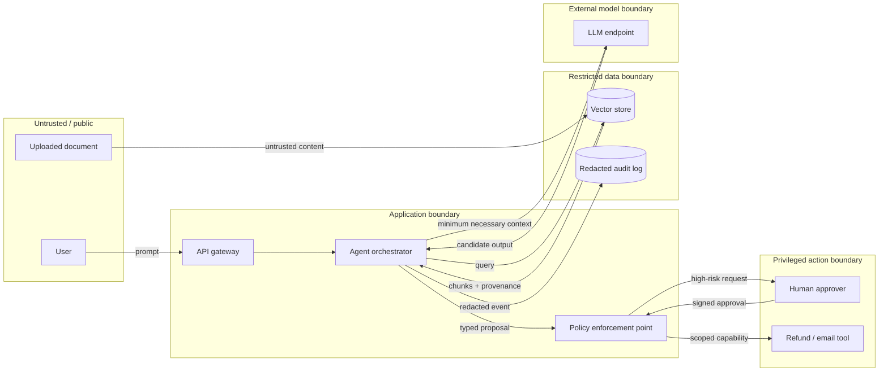
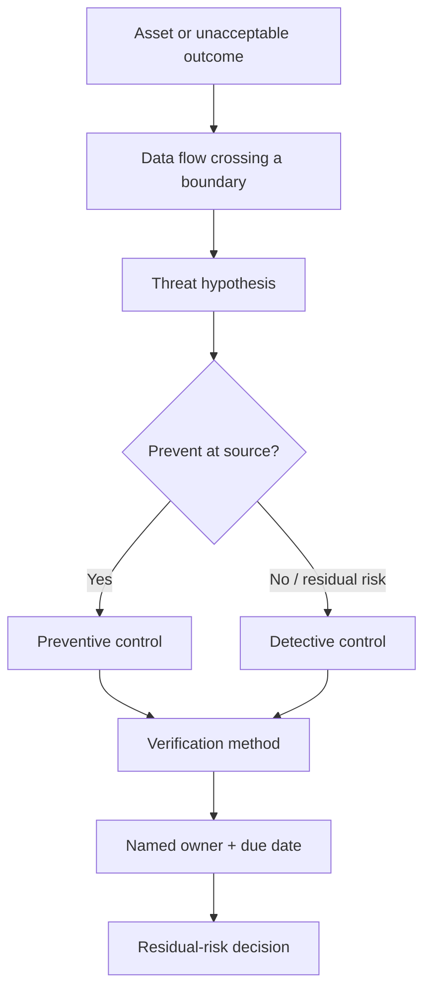

# 01 — Threat-Model an AI System as Code

**Time:** 25 minutes  
**Primary tool:** OWASP `pytm`  
**Artifact:** version-controlled data-flow model plus a prioritized control backlog.

Start with the system, not a generic list of “AI risks.” The useful unit is an end-to-end product: users, orchestration code, model endpoint, retrieval stores, tools, logs, human approvers, and the trust boundaries between them.

## Reference architecture and trust boundaries

## Threat-to-control derivation

## Guided exercise

1. Run the model in `01_pytm_threat_model.ipynb` and inspect the generated DFD text.
2. Mark each data flow by **origin trust**, **sensitivity**, **authorization context**, and **side-effect potential**.
3. Choose three unacceptable outcomes, for example secret disclosure, cross-tenant retrieval, and unauthorized refund.
4. For each, write an attack path and attach at least one prevention, one detection, and one executable verification.
5. Commit `rag_agent_tm.py` beside the application code and review it whenever a boundary or tool changes.

## Recommended use of `pytm`

Use `pytm` for repeatable architecture-as-code and threat enumeration. Do not treat generated findings as an automatically prioritized answer. Add your product’s business impact, data classification, tenant model, tool permissions, and deployment assumptions. Keep a small, reviewable model rather than a decorative diagram no one updates.

**Done means:** the DFD is generated, three high-risk paths are recorded, every selected threat has an owner/control/test, and the model is ready for code review.
