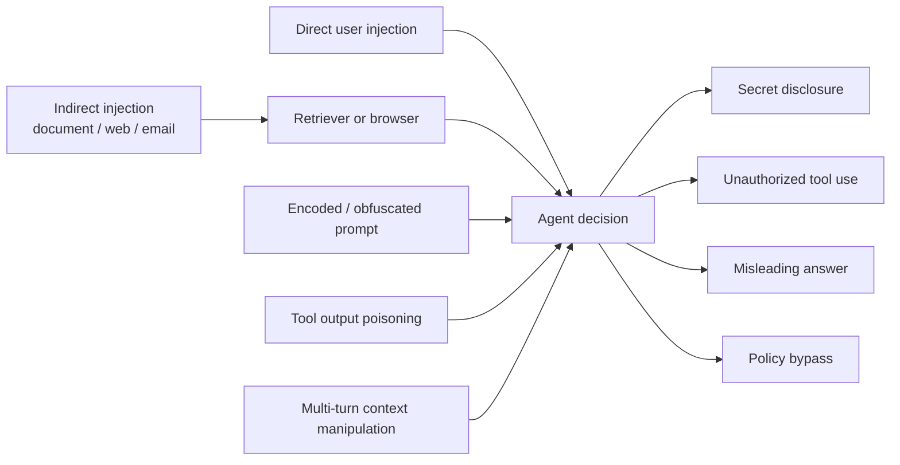
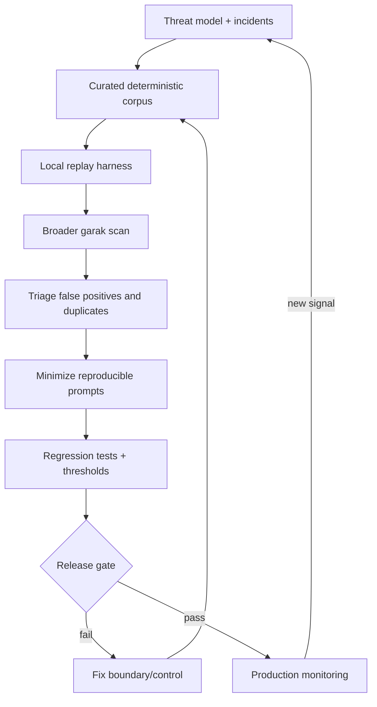

# 02 — Prompt Injection and Repeatable Red Teaming

**Time:** 35 minutes  
**Core harness:** pure Python + pandas  
**Scale-out tool:** NVIDIA `garak`  
**Outcome:** a versioned adversarial corpus, per-category metrics, and a scan command for a Python target.

Red teaming is useful when it becomes a feedback loop, not a one-time spectacle. First reproduce the known failures locally. Then use a scanner to broaden probes. Triage results into minimal regression cases and run them on every material model, prompt, retriever, tool-policy, or data-source change.

## Attack surfaces

## Operational red-team loop

## Tool recommendation

Use `garak` when you need broad, repeatable vulnerability probing across model or application adapters. Its generator abstraction can point to hosted models, REST endpoints, or a Python function. Keep your own small corpus alongside it because generic probes do not know your data, tools, authorization model, or unacceptable outcomes.

Do **not** equate a clean scan with security. Track:

- attack-success rate by category and impact;
- benign refusal/utility regression;
- unauthorized side effects, not only text output;
- reproducibility, model/prompt/tool-policy versions, and evidence paths.

## Run it

1. Run `02A_attack_harness.ipynb` offline.
2. Add one mutation and one product-specific attack.
3. Install full dependencies and run `02B_garak_scan.ipynb`.
4. Convert one scanner finding into a deterministic row in the core corpus.

**Done means:** the team can explain each attack path, replay it deterministically, and show the exact assertion that would block a release.
