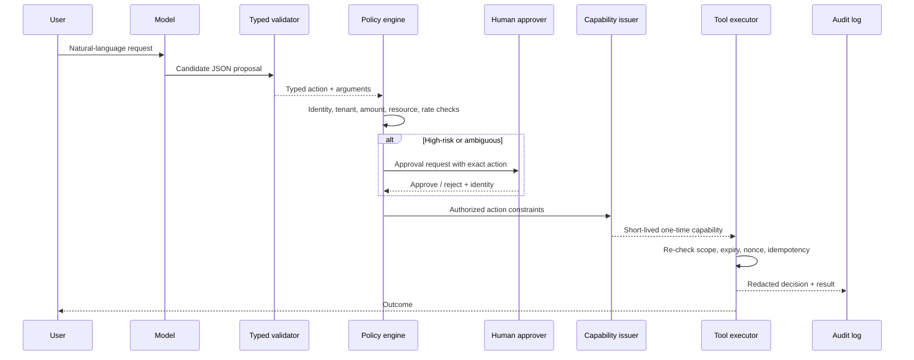
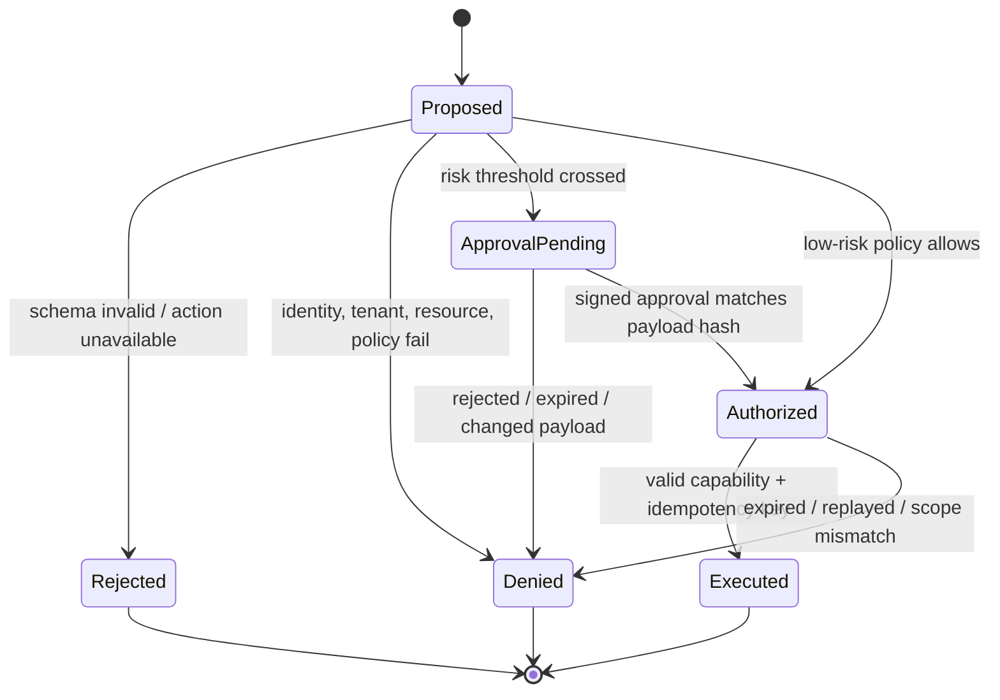

# 03 — Secure Agent Tools with Capabilities, Not Hope

**Time:** 30 minutes  
**Tooling:** Pydantic, explicit policy code, one-time capability objects  
**Outcome:** model proposals are separated from authorization and execution.

An agent becomes dangerous when natural-language output is treated as authority. The model may propose an action; only trusted application code should parse it, authorize it against identity and resource context, obtain approval where required, mint a narrow capability, and call the tool.

## Required control plane

## State machine

## Design recommendations

- Give the model a small catalog of **intent-level proposals**, not raw shell, SQL, URL, or arbitrary function access.
- Bind authorization to the authenticated user, tenant, exact resource, amount, action, expiration, and payload hash.
- Require re-authorization when arguments change after approval.
- Default to read-only or draft-only tools; isolate irreversible tools behind a separate service and credential.
- Use idempotency keys and replay protection. Log policy reason codes without raw secrets or PII.
- Treat tool results as untrusted input when they re-enter the model context.

## Lab

Run `03_capability_gates.ipynb`. You will parse candidate proposals, see why schema validation is not authorization, evaluate several policy outcomes, mint a scoped capability, reject replay, and export policy evidence.

**Done means:** no executor accepts raw model output; cross-tenant and oversized requests are denied or approval-gated; a used capability cannot be replayed; the benign lookup still succeeds.
