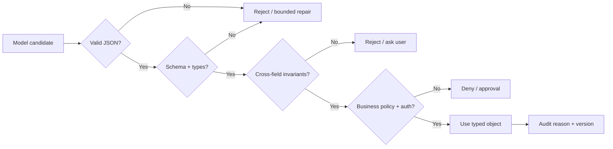
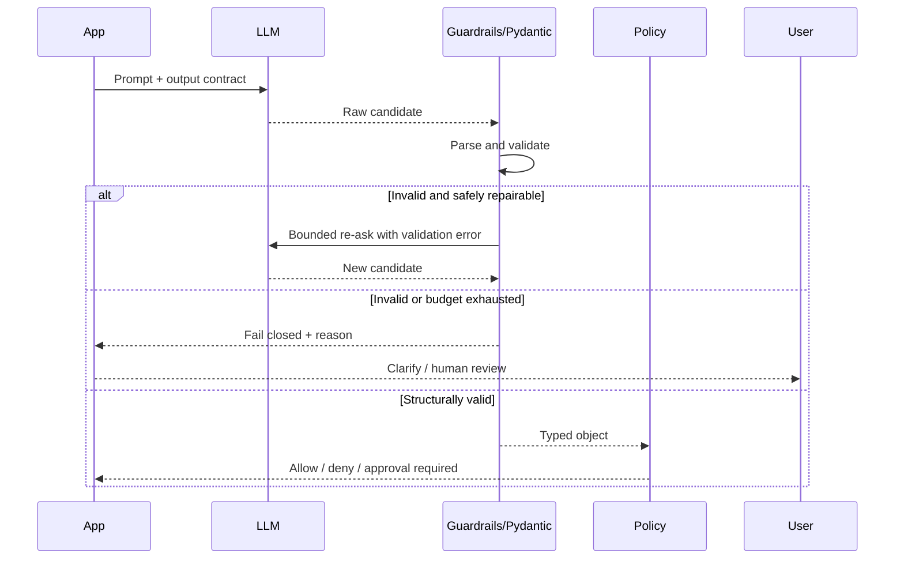

# 04 — Validate Model Output Before It Becomes Program State

**Time:** 25 minutes  
**Primary tools:** Pydantic and Guardrails AI  
**Outcome:** malformed or out-of-policy outputs fail closed, with structured evidence.

A model response is untrusted input. Validate syntax, schema, allowed values, cross-field invariants, and business policy before the value reaches a database, UI renderer, tool, or downstream prompt. Structured generation can reduce formatting errors; it does not prove truth, safety, or authorization.

## Layered validation

## Guard outcome handling

## Specific recommendations

- Use Pydantic `extra="forbid"`, enums/Literals, bounded numbers/strings, and explicit optional fields.
- Keep authorization, database existence checks, and high-impact policy outside the schema validator.
- Cap repair/re-ask attempts and preserve the original invalid output in restricted evidence, not ordinary logs.
- Test adversarial JSON: unknown fields, duplicate concepts, extreme values, Unicode confusables, strings where numbers are expected, and policy text embedded inside data fields.
- Escape or render output safely for its final sink. Valid JSON can still contain HTML/SQL/prompt injection for the next component.

Run `04_guardrails_pydantic.ipynb`. The Pydantic path shows six malformed candidates failing closed and one *structurally valid but content-unsafe* candidate passing. The same schema is then wrapped in a Guardrails AI `Guard.for_pydantic(...)` with a custom `@register_validator` (`workshop/no-secret-marker`) attached via `json_schema_extra={"validators": [...]}`, run once with `OnFailAction.EXCEPTION` and once with `OnFailAction.FIX`, so the difference between *schema* and *content* validation — and between validation and authorization — is concrete.

**Done means:** invalid candidates are rejected, valid structure still passes through a separate policy decision, and a JSON validation report is exported.
