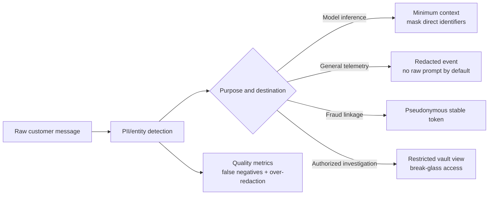
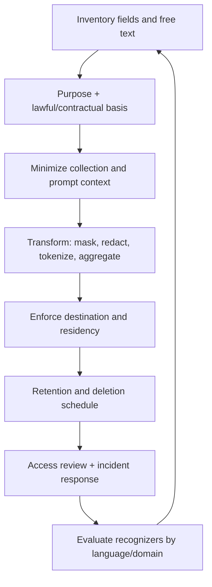

# 05 — Detect and Transform PII Before It Crosses a Boundary

**Time:** 25 minutes  
**Primary tool:** Microsoft Presidio  
**Outcome:** purpose-specific views for model input, telemetry, and restricted investigations.

Privacy is not “run a redactor somewhere.” Decide which data is necessary for each purpose, transform it **before egress**, preserve provenance, and test both missed detections and damaging over-redaction. PII detection is probabilistic and locale-specific; combine recognizers, deterministic identifiers, context, and human review for high-risk workflows.

## Purpose-specific data paths

## Privacy control lifecycle

## Specific recommendations

- Run detection before sending data to a model provider, vector store, analytics system, or trace collector.
- Add custom recognizers for customer IDs, case numbers, account formats, internal project names, and Indian phone/address patterns relevant to your system.
- Prefer irreversible redaction for general logs. Use keyed pseudonyms only when correlation is necessary; protect and rotate the key.
- Store raw inputs only where purpose, access, retention, and deletion are explicit. Never use production secrets as test canaries.
- Measure recall and over-redaction on a labeled, representative corpus by language and document type. Regex alone is an illustrative fallback, not comprehensive PII protection.

Run `05_presidio_redaction.ipynb`. It builds a real Presidio `AnalyzerEngine` (spaCy `en_core_web_sm`, installed from the lock file — no `spacy download` step) with the predefined recognizers plus two custom `PatternRecognizer`s, then:

1. shows the raw hit list including **false positives** (`UK_NHS` fires at score 1.0 on an Indian mobile number) and overlapping spans, and fixes it with an `entities=[...]` allow-list and `score_threshold`;
2. measures **recall on a labelled mini-set** — the built-in `EmailRecognizer` misses `name@example.test` because it validates TLDs, spaced phone formats are missed — and closes the gaps with fallback recognizers (67 % → 100 %);
3. anonymises with one `OperatorConfig` per entity (`replace`, `mask`, `hash`, `keep`) and builds purpose-specific views (model input, general log, HMAC pseudonym for fraud linkage);
4. asserts that no raw identifier reaches the exported evidence.

**Done means:** direct identifiers are absent from the model/log views, a stable pseudonym is available only for the stated purpose, and redaction evidence is exported without raw sensitive values.
