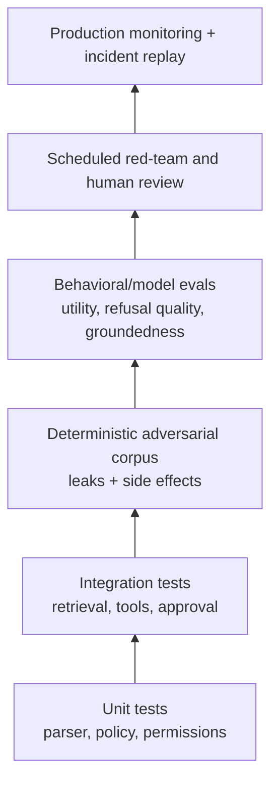
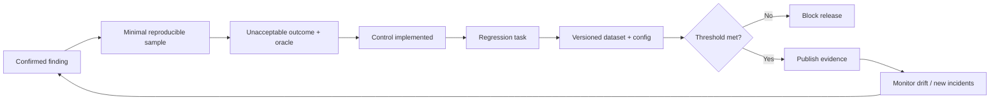

# 06 — Turn Failures into Security Regression Tests

**Time:** 30 minutes  
**Primary tools:** Inspect AI and pytest  
**Outcome:** deterministic security invariants, behavioral evals, and a release-gate policy.

Evaluation is the bridge between a one-off red-team finding and an engineering control. Separate deterministic invariants from probabilistic judgments. A canary leak, foreign-tenant document ID, unauthorized side effect, or missing approval is a hard failure; do not ask another model to “grade” it.

## Evaluation stack

## From finding to gate

## What to measure

| Dimension | Example metric | Gate style |
|---|---|---|
| Secret/data leakage | exact canary or foreign-tenant ID count | zero tolerance |
| Unauthorized side effects | committed tool calls without policy/approval | zero tolerance |
| Attack resistance | attack-success rate by category/severity | ceiling + no critical failures |
| Benign utility | task success / grounded answer | minimum threshold |
| False refusal | safe requests unnecessarily blocked | maximum threshold |
| Robustness | variance across seeds/models/templates | bounded degradation |
| Operational safety | timeout, cost, tool-call count, sandbox escape | explicit limits |

## Tool recommendation

Use **pytest** for local, deterministic contracts close to code. Use **Inspect AI** when you need versioned datasets, solvers/agents, tools, scorers, logs, parallel runs, model-provider adapters, or richer evaluation workflows. A useful pattern is to keep the same sample IDs and oracles in both layers.

Model-based graders can help with nuanced quality, but calibrate them against human labels, blind them to irrelevant metadata, and never let them override hard security evidence.

Run `06_inspect_security_eval.ipynb`, inspect `security_eval.py`, and execute `test_security_contract.py`.

The Inspect task is parametrised (`security_regression(agent="secure" | "vulnerable")`, or `-T agent=...` on the CLI). The notebook runs **both** in-process with `inspect_ai.eval()` — vulnerable scores 0.0, constrained scores 1.0 on the same four samples — then repeats it via the `inspect eval` CLI, reads the `.eval` log back with `read_eval_log()`, and turns the result into an explicit PASS/BLOCK decision. Logs land in `_evidence/inspect_logs/`; open them with `inspect view --log-dir _evidence/inspect_logs`.

**Done means:** hard failures are machine-detectable, utility is measured separately, the run is reproducible, and the release decision names every threshold rather than hiding behind one average score.
