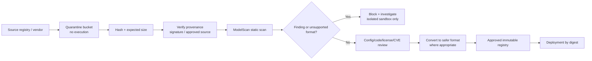
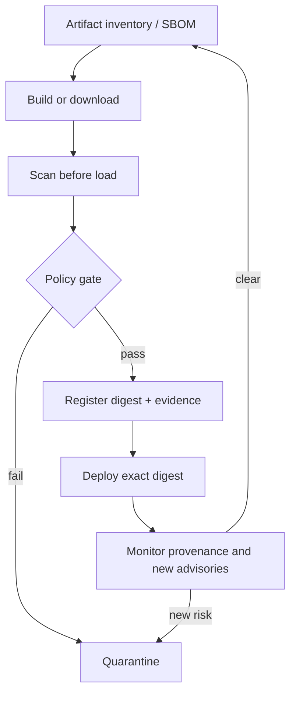

# 07 — Treat Model Artifacts as Potentially Executable Supply-Chain Inputs

**Time:** 20 minutes  
**Primary tool:** Protect AI ModelScan  
**Outcome:** quarantine-before-load workflow, artifact hashes, scan evidence, and an admission decision.

Some model formats use general-purpose serialization and can execute code when loaded. The first safety rule is operational: **do not import, deserialize, or load an untrusted artifact merely to inspect it.** Scan and verify it in quarantine before it reaches a training notebook, model server, or developer machine.

## Admission pipeline

## Continuous verification

## Specific recommendations

- Pin model/repository revisions and deploy by content digest, not a mutable tag.
- Verify publisher identity and expected hashes/signatures where available; preserve license and data-use terms.
- Scan before loading, including models produced by your own pipeline after storage or transfer.
- Avoid enabling arbitrary remote model code. Review custom loaders, tokenizer code, templates, native libraries, and serving containers separately.
- Prefer formats designed without arbitrary code execution where compatible, but still validate tensor metadata, configuration, provenance, and resource limits.
- Run conversion or deeper inspection in a network-restricted disposable sandbox with no production credentials.

`07_modelscan.ipynb` creates a benign and a deliberately suspicious pickle **without loading either**, hashes them, scans both through the ModelScan CLI (`-r json` report, exit code 0 vs 1, `CRITICAL: Use of unsafe operator 'system'`) and the Python API (`ModelScan(...).scan()`), and asserts on the results. It then encodes the admission policy as code (unscanned, unverified-provenance, or flagged artifacts are all `block`). The scanner binary is resolved with `workshop_utils.cli("modelscan")` so it works even when the venv is not on `PATH`.

**Done means:** the scanner runs before any loader, the decision records digest/source/scanner version/findings, and an unsafe or unsupported artifact is blocked rather than “tried once.”
