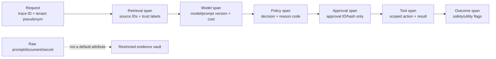
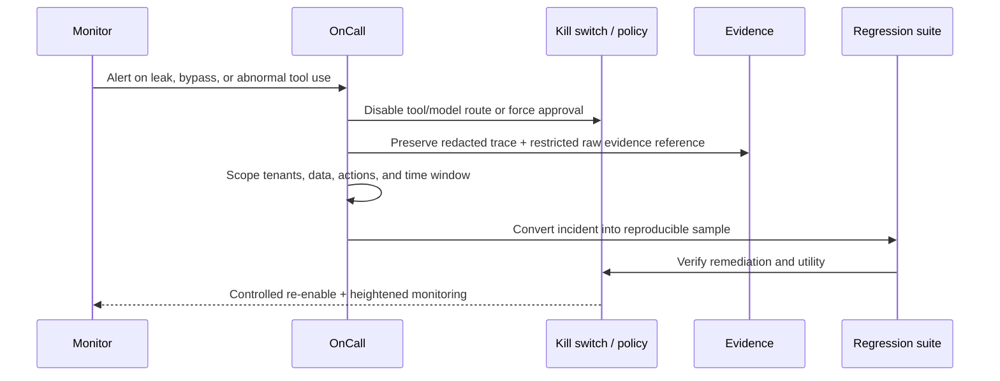

# 08 — Trace Decisions Without Turning Telemetry into a Data Leak

**Time:** 25 minutes  
**Primary tools:** OpenTelemetry; optional Arize Phoenix backend  
**Outcome:** redacted spans, decision-oriented telemetry, and a replayable incident packet.

AI observability must answer more than latency and token count: which model/prompt/retriever/tool-policy versions ran, which trusted sources were used, what policy decision occurred, whether approval was present, and what side effect happened. At the same time, raw prompts, retrieved documents, secrets, and customer data should not silently become broadly accessible logs.

## Trace schema

## Incident loop

## Specific recommendations

- Record hashes or stable IDs for prompts/documents; store raw content only in a restricted, purpose-bound evidence system when necessary.
- Use reason codes and structured attributes, not free-text dumps. Pseudonymize user/tenant identifiers.
- Propagate one trace ID through retrieval, model, policy, approval, and tool execution.
- Alert on outcomes: secret canary, foreign-tenant source, policy bypass, unexpected tool, missing approval, replay, unusual tool volume—not merely on “toxic text.”
- Predefine kill switches: disable a tool, force human approval, route to a safer model, stop retrieval from a source, revoke credentials, or return read-only mode.
- Use Phoenix or another OpenTelemetry-compatible backend to inspect traces and connect them to eval datasets; control access and retention like any sensitive production data.

Run `08_otel_incident_trace.ipynb`. It exports spans in memory, asserts that raw PII/secrets are absent, detects a simulated incident, and produces a compact incident packet.

**Done means:** a developer can reconstruct the decision path using redacted attributes, identify the control that fired, and replay the incident without searching unstructured logs.
