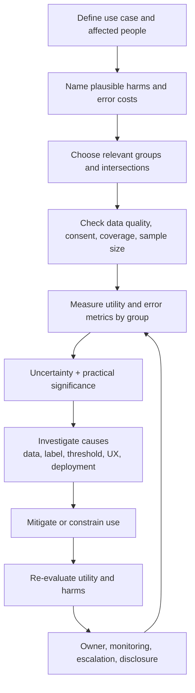
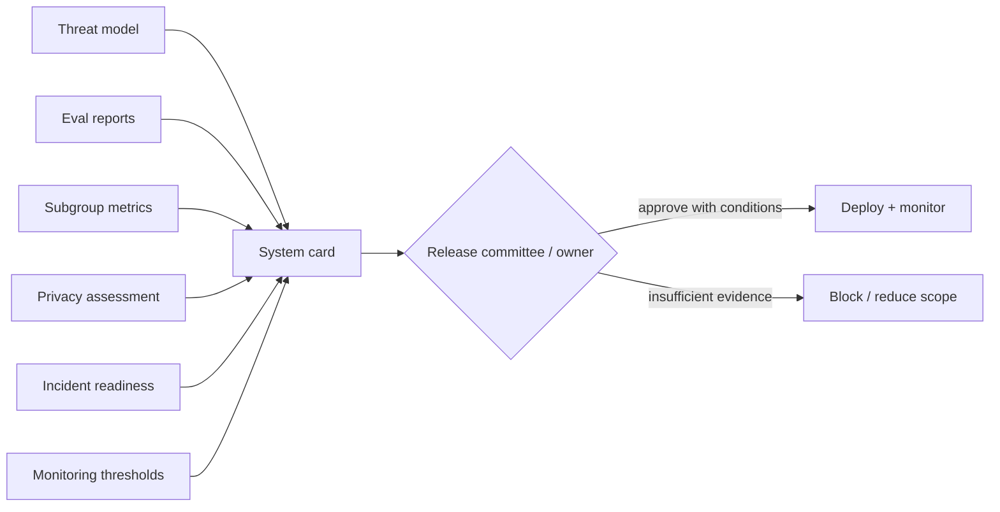

# 09 — Measure Unequal Failure and Publish Honest System Evidence

**Time:** 35 minutes  
**Primary tools:** Fairlearn and Hugging Face `ModelCard`  
**Outcome:** subgroup metrics with uncertainty/context plus a system card that names controls, limitations, and owners.

Responsible AI becomes actionable when product harms are translated into measurable outcomes, disaggregated where relevant, reviewed with affected-domain context, and tied to a decision. “Fairness” is not one universal scalar and a model card is not proof by itself. Both are evidence that supports governance, engineering, and human oversight.

## Fairness assessment workflow

## Evidence package

## Specific recommendations

- Start from harm and decision context; do not select a metric merely because a library exposes it.
- Report group sample sizes, base rates, false-positive/false-negative rates, utility, and uncertainty. Inspect intersections where sample sizes support it.
- Treat sensitive-feature collection as a privacy and governance decision. Secure access, restrict use, and document why each attribute is necessary.
- Do not apply a single ratio threshold as a universal legal or ethical conclusion. Investigate practical impact, domain obligations, and trade-offs.
- Validate mitigations on held-out data and in the deployed workflow; shifting one metric can worsen another group or the underlying service.
- Publish a **system** card for RAG/agent products: base model, prompts, retrieval, tools, policies, data, monitoring, and human oversight all affect outcomes.

Run `09A_fairlearn.ipynb` for synthetic subgroup analysis — Fairlearn's `MetricFrame` with the built-in `count`, `selection_rate`, `false_positive_rate`, `false_negative_rate`, plus `demographic_parity_difference` / `equalized_odds_difference`, a bootstrap CI, and a plot — then `09B_model_and_system_card.ipynb` to produce a release-facing card that pulls its numbers (attack-success rates, garak results, incident detection, equalized-odds gap) from the `_evidence/` files earlier labs produced. The card notebook fails if a cited number is missing, so run the earlier modules first.

**Done means:** no aggregate metric hides a known subgroup failure; uncertainty and sample size are visible; the card states intended use, excluded use, security/privacy controls, evaluations, limitations, monitoring, and accountable owners.
