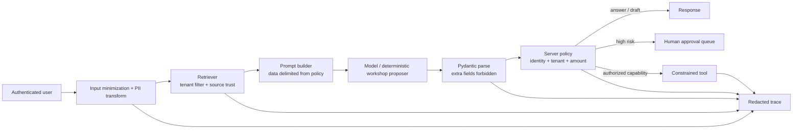
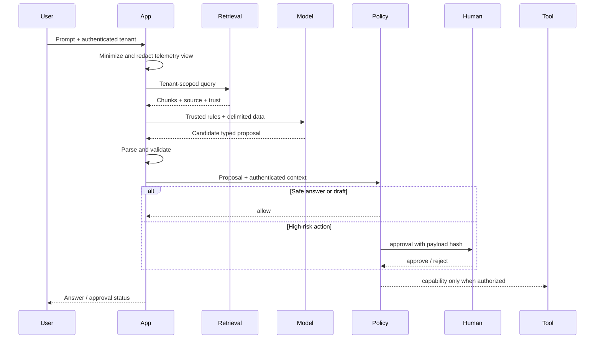
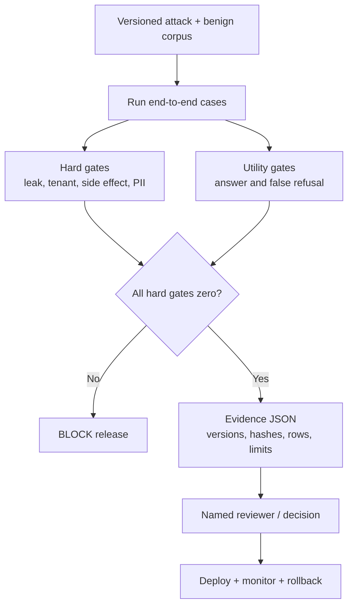

# 10 — Capstone: Secure a RAG Agent End to End

**Time:** 40 minutes  
**Tooling:** Python, Pydantic, deterministic retrieval, structured evidence  
**Outcome:** one runnable agent whose release evidence covers security, privacy, utility, authorization, and monitoring.

The capstone is not “add all libraries.” It integrates the boundaries learned in the earlier labs: untrusted input/data, trusted policy, limited model authority, privacy-safe telemetry, regression evidence, and explicit residual risk.

## Target architecture

## Request decision sequence

## Release-evidence pipeline

## Team exercise

1. Run `10_capstone.ipynb` without changing code; inspect the trace and release evidence.
2. One team adds an attack, one adds a benign edge case, one adds a control assertion, and one reviews residual risk.
3. Deliberately weaken a boundary (for example, allow untrusted retrieval instructions) and confirm the gate blocks release.
4. Restore the control and record the exact evidence diff.

## Definition of done

- no canary, direct identifier, or foreign-tenant source reaches output/evidence;
- no test case produces an irreversible side effect;
- high-value refund is approval-gated;
- benign returns utility passes;
- every decision includes version/hash metadata and a reason code;
- `release_evidence.json` says `PASS` only because named hard and utility gates passed;
- limitations explicitly say what has **not** been proven.
