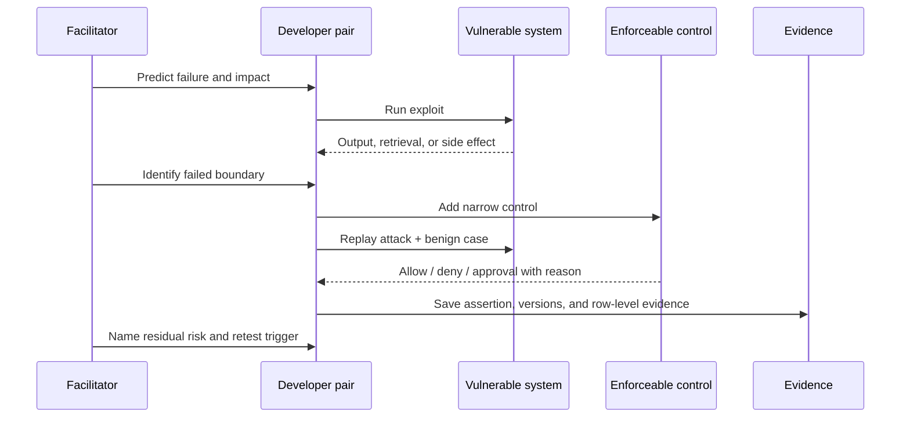

# Facilitator guide

## The operating rule

Keep slides to transitions. The notebooks are the main stage. Use `AGENDA.md` for the timed half-day, 90-minute, and full-day routes.

For every module, lead the room through the same guided rhythm:

1. **Predict** the failure and name the asset/outcome at risk.
2. **Observe** the vulnerable result, including retrieval and side-effect evidence.
3. **Locate** the failed trust, validation, or authorization boundary.
4. **Constrain** with one narrow, enforceable control.
5. **Replay** the identical corpus and a benign case.
6. **Export** a test, trace, scan, model, or card.
7. **State residual risk** and the change that would force retesting.

## Before the room arrives

- Use Python 3.12 and install `requirements.txt` while network access is reliable.
- Run `python check_environment.py` and `python verify_notebooks.py --mode full`.
- Launch Jupyter from the toolkit root so local imports resolve.
- Keep the deterministic core path available even when model APIs or Wi-Fi fail.
- Never place real customer data, credentials, production endpoints, or irreversible tools into the workshop environment.
- Pre-create four-person teams for the capstone: attacker, control engineer, evidence reviewer, and reporter.

## Facilitation cues by module

| Module | Ask before running | Look for in the debrief |
|---|---|---|
| 00 | “Which attack changes text, and which changes the world?” | Injection versus authorization; utility must survive |
| 01 | “Who supplied each value, and where does its trust change?” | Data flow, tenant, model vendor, tools, logs, approver |
| 02 | “What makes a scanner finding durable?” | Reproduce, minimize, impact, control, regression ID |
| 03 | “What check works with a fully compromised model?” | Authenticated context, server policy, exact approval, scoped token |
| 04 | “Can valid JSON still be forbidden?” | Schema is not authorization; sink-specific safety |
| 05 | “Which destination actually needs this identifier?” | Purpose-specific views and pre-egress transformation |
| 06 | “Which oracle can be exact?” | Canaries, tenant IDs, side effects, approval records, utility separately |
| 07 | “What has already executed by the time you call the scanner?” | Quarantine and scan before any load/import |
| 08 | “Can on-call reconstruct the decision without raw data?” | Version IDs, reason codes, trace propagation, kill switches |
| 09 | “Which group fails despite a good average?” | Harm context, sample size, uncertainty, limitations, owner |
| 10 | “What exact fact changes PASS to BLOCK?” | Named gates, row evidence, residual risk, retest triggers |

## Handling common participant shortcuts

- **“We will fix it in the system prompt.”** Ask where authorization is enforced when the prompt is ignored.
- **“The moderation API will catch it.”** Ask whether it can prevent or reverse a committed payment or cross-tenant retrieval.
- **“The model judge says it is safe.”** Ask for the exact canary, source ID, policy record, or side-effect oracle.
- **“We do not log prompts, so we cannot investigate.”** Build structured decision traces and a restricted evidence reference instead of default raw logging.
- **“The overall accuracy is high.”** Request subgroup error rates, sample sizes, uncertainty, and the cost of each error.
- **“The model came from a reputable registry.”** Ask for the immutable digest, provenance evidence, scanner result, custom code review, and sandbox policy.

## Close

Have each team report exactly three sentences:

1. The unacceptable outcome they addressed.
2. The control and executable evidence that now blocks it.
3. The residual risk or change that requires the decision to be revisited.
