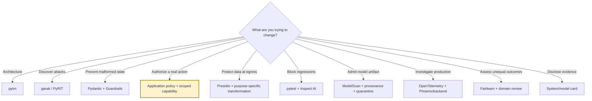

# Python toolkit landscape and recommendations

The bundled stack is intentionally opinionated. It favors tools that work from Python/Jupyter, produce artifacts suitable for CI or review, and clarify rather than blur the difference between testing and enforcement.

## Recommended defaults

| Problem | Start with | Use it for | Do not mistake it for |
|---|---|---|---|
| Architecture and threat modeling | **OWASP pytm** | Versioned actors, boundaries, flows, DFDs, and threat hypotheses | Automatic business-risk prioritization |
| Broad LLM/application probing | **NVIDIA garak** | Repeatable probes, detectors, reports, and Python/REST/model adapters | Proof that an application is secure |
| Product-specific red-team regression | **pytest + a small pandas corpus** | Stable IDs, exact canary/side-effect oracles, pull-request gates | Broad discovery by itself |
| Structured model output | **Pydantic 2** | Strict schemas, enums, bounds, cross-field invariants | Authorization or truth verification |
| Guard orchestration | **Guardrails AI** | Pydantic-backed parsing, validators, bounded re-asks, guard outcomes | The only boundary protecting tools or data |
| PII detection and transformation | **Presidio** | Built-in/custom recognizers and anonymization operators | A universal detector with perfect recall |
| Evaluation framework | **Inspect AI** | Datasets, solvers/agents, tools, scorers, logs, limits, repeatable runs | A replacement for deterministic unit/integration tests |
| Serialized model scanning | **ModelScan** | Static inspection before loading common model artifacts | Provenance, signature, dependency, or runtime-sandbox review |
| Tracing | **OpenTelemetry** | Vendor-neutral structured spans and context propagation | Permission to log raw prompts and documents |
| AI trace/eval investigation UI | **Phoenix** (optional) | Inspect OTel/OpenInference traces and connect failures to evals | A privacy control unless data is minimized before export |
| Subgroup assessment | **Fairlearn** | `MetricFrame`, group metrics, differences/ratios, mitigation experiments | A single universal definition of fairness |
| Disclosure artifact | **Hugging Face ModelCard + system-card template** | Versioned intended use, evidence, limitations, and metadata | Independent assurance or approval |

## Alternatives worth knowing

| Tool | Prefer it when | Why it is not the default live lab here |
|---|---|---|
| **Microsoft PyRIT** | You need orchestrated multi-turn red-team campaigns, converters, targets, and richer attack workflows | Better as an advanced follow-on; more moving parts for a first room-wide exercise |
| **Giskard** | Your team already uses its ML/LLM scan and test ecosystem | The workshop keeps security oracles and application authorization more explicit |
| **DeepEval / DeepTeam** | You want Python-native LLM quality or adversarial evaluation integrated with an existing test suite | Keep exact leak, tenant, and side-effect failures outside model-graded metrics |
| **Ragas** | Your main need is RAG quality—retrieval/context/answer metrics and experiments | Quality metrics do not cover authorization or tool effects |
| **NeMo Guardrails** | You need programmable conversational rails and dialogue policies | Conversation policy must still terminate at server-side authorization |
| **LLM Guard** | You need a deployable set of input/output scanners and sanitizers | Scanner decisions are defense-in-depth, not the sole control for high-impact actions |
| **Adversarial Robustness Toolbox (ART)** | You own the training/inference layer for classical ML or deep learning and need evasion/poisoning/extraction research tooling | The bundled talk focuses on LLM/RAG/agent application security |
| **AIF360** | You need a broader fairness metric/mitigation catalog or existing IBM ecosystem integration | Fairlearn's `MetricFrame` is a smaller first teaching surface |
| **Opacus** | You are training PyTorch models with differential privacy | This workshop focuses on application PII boundaries, not private training |
| **Langfuse / other LLM observability platforms** | They are already your operational system of record | The lab teaches a portable OTel schema first, then lets you choose a backend |

## Selection decision tree

## A practical minimum stack for most developer teams

1. **Pydantic + explicit policy code** at every model-to-program boundary.
2. **pytest** for non-negotiable leaks, tenant isolation, approvals, permissions, and side effects.
3. **A versioned adversarial corpus**, supplemented by `garak` or PyRIT for discovery.
4. **Presidio or equivalent pre-egress transformation** for free text that may contain PII.
5. **OpenTelemetry decision traces** with allow-listed, redacted attributes.
6. **One owned threat model and one system card** tied to release evidence and change triggers.

A tool should earn its place by producing a control, a reproducible finding, or reviewable evidence. Avoid assembling a wall of scanners that all produce scores but own no decision.
