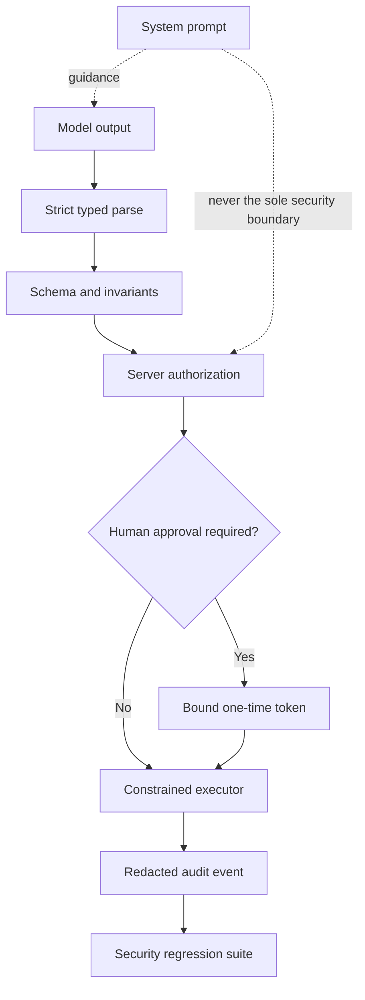

# Responsible AI + AI Security: a hands-on workshop for developers

A hands-on-first workshop for developers building LLM, RAG, and agentic systems. Eleven folders,
thirteen Jupyter notebooks, one deliberately vulnerable agent, and one rule: **every module ends
with an executable check and a piece of evidence**, never a slide.

The workshop starts by breaking a vulnerable support agent. Every later module adds a control,
attacks it again, and records evidence. The capstone has typed commands, authorization, privacy
controls, regression tests, traces, and a release gate — not merely a stronger system prompt.

**All 13 notebooks are verified to execute end-to-end** in the pinned Python 3.12 environment, from
the folder JupyterLab actually opens them in (`python verify_notebooks.py --mode full`, ~35 s).
No API key, no model download, no network call inside a lab.

## Get running

```bash
uv sync                                       # Python 3.12 + exact lock (uv.lock), ~2.3 GB, CPU-only torch
uv run python verify_notebooks.py --mode full # proves every notebook runs on *this* laptop
uv run jupyter lab                            # open 00_Start_Here/00_break_the_agent.ipynb
```

`pip` users: `python3.12 -m venv .venv && . .venv/bin/activate && pip install --require-hashes -r requirements.txt`.
See `QUICKSTART.md` for Windows, offline fallback, and troubleshooting.

## What is inside

| Module | Build / break | Primary Python tools (pinned) | Time |
|---|---|---|---:|
| `00_Start_Here` | Break a vulnerable RAG + tool agent; write the first security contract | pandas, `demo_agent.py` | 15 min |
| `01_Threat_Modeling` | Architecture + trust boundaries as code; watch a control remove a threat | OWASP **pytm 1.4** (`LLM01–LLM09` rules) | 20 min |
| `02_Prompt_Injection_and_Red_Teaming` | Attack corpus with mutations; garak scan of vulnerable *vs* constrained target | pandas, NVIDIA **garak 0.16** | 30 min |
| `03_Agent_Tool_Security` | Typed proposals, policy, approval binding, one-time capabilities, replay | **Pydantic 2** | 25 min |
| `04_Output_Validation_and_Guardrails` | Schema vs invariants vs content vs policy; custom validator, `EXCEPTION`/`FIX` | Pydantic, **Guardrails AI 0.11** | 20 min |
| `05_PII_and_Data_Boundaries` | Real `AnalyzerEngine` (spaCy), false positives, recall test, per-purpose views | Microsoft **Presidio 2.2** + `en_core_web_sm` | 20 min |
| `06_Evaluations_and_Security_Regression` | pytest gate + Inspect task run against both agents (0.0 → 1.0) | **Inspect AI 0.3**, pytest | 25 min |
| `07_Model_Supply_Chain` | Scan a malicious pickle without loading it; admission policy as code | ProtectAI **ModelScan 0.8** | 15 min |
| `08_Observability_and_Incident_Response` | Allow-listed OTel spans, PII assertions, incident packet from span attributes | **OpenTelemetry SDK**, optional Phoenix/OTLP | 20 min |
| `09_Fairness_and_Responsible_AI_Evidence` | `MetricFrame` subgroup errors + CI; system card generated from real evidence | **Fairlearn 0.14**, Hugging Face `ModelCard` | 25 min |
| `10_Capstone_Secure_RAG_Agent` | End-to-end control plane and `release_evidence.json` PASS/BLOCK | Pydantic, everything above | 35 min |

Each folder has a `README.md` with at least two Mermaid diagrams (control flow, boundary/state
machine), a facilitator-friendly "Done means" line, and the notebook(s).

## Default half-day route

Do not begin with a policy lecture. Put attendees into `00_Start_Here/00_break_the_agent.ipynb` immediately.

```mermaid
flowchart LR
    A[00 Break agent] --> B[01 Draw trust boundaries]
    B --> C[02 Automate attacks]
    C --> D[03 Constrain tool authority]
    D --> E[04 Validate output]
    E --> F[05 Redact sensitive data]
    F --> G[06 Build regression tests]
    G --> H[07 Scan artifacts]
    H --> I[08 Trace and investigate]
    I --> J[09 Measure subgroup impact]
    J --> K[10 Capstone release gate]
```



Recommended timing is 4 h 30 min including a break and a real capstone block. `AGENDA.md` has the
exact run-of-show plus a 90-minute talk-with-keyboard route and a full-day extension;
`FACILITATOR_GUIDE.md` has the per-module questions to ask before and after each lab.

## The non-negotiable engineering principle



A system prompt, regex blocklist, moderation score, or LLM judge can contribute evidence. None should
be the sole boundary protecting money, data, credentials, code execution, or irreversible actions.

## Repository map

| Path | Purpose |
|---|---|
| `00_…`–`10_…/` | One folder per topic: `README.md` (diagrams + guidance) and notebook(s) |
| `demo_agent.py` | The shared vulnerable and constrained agents (deterministic, ~120 lines) |
| `workshop_utils.py` | `save_json`, `redact_for_logs`, `require_package`, `cli()` helpers |
| `pyproject.toml`, `uv.lock`, `.python-version` | The pinned environment (uv). `requirements.txt` is exported from the lock with hashes |
| `verify_notebooks.py` | Static / core / full verification; executes each notebook from its own folder |
| `check_environment.py` | Preflight: interpreter, packages, CPU-only torch |
| `_evidence/` | Generated outputs (git-ignored; see `_evidence/README.md`) |
| `AGENDA.md`, `FACILITATOR_GUIDE.md` | Run-of-show and facilitation cues |
| `TOOL_SELECTION.md`, `LIBRARY_LANDSCAPE.md` | Why these tools, and the alternatives (PyRIT, Giskard, DeepEval, NeMo Guardrails, LLM Guard, ART, AIF360, …) |
| `SOURCES_AND_VERSIONS.md`, `VERIFICATION.md`, `REVIEW_NOTES.md` | Provenance, what was tested and how, and what was fixed in this revision |

## Outputs attendees leave with

A Python threat model, a versioned attack corpus, garak reports for two targets, a typed capability
boundary, a content validator, a Presidio recall test, an Inspect eval log pair, a model-scan
admission decision, a redacted incident trace, subgroup metrics with uncertainty, a system card
generated from evidence, and `release_evidence.json` with an explicit PASS/BLOCK decision.

All examples use synthetic data and in-memory tools. No notebook performs a real refund, sends
messages, executes model-produced shell commands, loads an untrusted pickle, or contacts an external
model.
