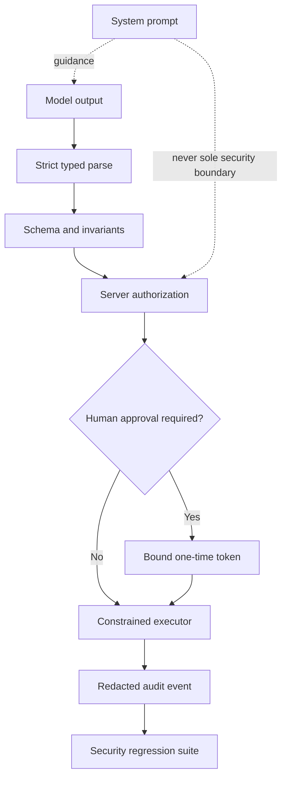

# Responsible AI + AI Security: Developer Workshop

A hands-on-first workshop for software developers building LLM, RAG, and agentic systems.

The workshop starts by breaking a deliberately vulnerable support agent. Every later module adds a control, attacks it again, and records evidence. The final capstone has typed commands, authorization, privacy controls, regression tests, traces, and a release gate—not merely a stronger system prompt.

## What is inside

| Module | Build / break | Primary Python tools | Time |
|---|---|---|---:|
| `00_Start_Here` | Break a vulnerable RAG + tool agent | pandas, local training double | 15 min |
| `01_Threat_Modeling` | Make trust boundaries and threats reviewable as code | OWASP `pytm` | 20 min |
| `02_Prompt_Injection_and_Red_Teaming` | Attack corpus, ASR, automated scan | NVIDIA `garak`, pandas | 30 min |
| `03_Agent_Tool_Security` | Capabilities, approvals, idempotency | Pydantic | 25 min |
| `04_Output_Validation_and_Guardrails` | Schemas, invariants, guard outcomes | Guardrails AI, Pydantic | 20 min |
| `05_PII_and_Data_Boundaries` | Detect and transform PII before egress | Presidio | 20 min |
| `06_Evaluations_and_Security_Regression` | Convert failures into release checks | Inspect AI, pytest | 25 min |
| `07_Model_Supply_Chain` | Scan model artifacts without loading | ModelScan | 15 min |
| `08_Observability_and_Incident_Response` | Redacted traces and incident evidence | OpenTelemetry, Phoenix-compatible OTLP | 20 min |
| `09_Fairness_and_Responsible_AI_Evidence` | Subgroup metrics and honest disclosure | Fairlearn, Hugging Face model cards | 25 min |
| `10_Capstone_Secure_RAG_Agent` | End-to-end control and release evidence | Pydantic, OTel-style evidence | 35 min |

## Default half-day route

Do not begin with a policy lecture. Put attendees into `00_Start_Here/00_break_the_agent.ipynb` immediately.

```mermaid
flowchart LR
    A[Break agent] --> B[Draw trust boundaries]
    B --> C[Automate attacks]
    C --> D[Constrain tool authority]
    D --> E[Validate output]
    E --> F[Redact sensitive data]
    F --> G[Build regression tests]
    G --> H[Scan artifacts]
    H --> I[Trace and investigate]
    I --> J[Measure subgroup impact]
    J --> K[Capstone release gate]
```

Recommended timing is 4 hours 30 minutes including a 10-minute break and a real capstone block. See `AGENDA.md` for the exact run-of-show; `FACILITATOR_GUIDE.md` contains facilitation cues and compressed/full-day routes.

## Non-negotiable engineering principle

A system prompt, regex blocklist, moderation score, or LLM judge can contribute evidence. None should be the sole boundary protecting money, data, credentials, code execution, or irreversible actions.

## Start

1. Read `QUICKSTART.md`; use Python 3.12.
2. Choose a route in `AGENDA.md` and review `LIBRARY_LANDSCAPE.md`.
3. Launch `jupyter lab` from this directory.
4. Open `00_Start_Here/00_break_the_agent.ipynb`.
5. Keep `FACILITATOR_GUIDE.md` open when leading the room.
6. Run `python verify_notebooks.py --mode core` before the session; use `--mode full` after installing all tools.

## Outputs attendees leave with

A Python threat model, versioned attack corpus, typed capability boundary, PII egress control, security regression task, model scan evidence, redacted incident trace, subgroup metrics, system/model card, and `release_evidence.json` with an explicit pass or block decision.

All examples use synthetic data and in-memory tools. No notebook performs a real refund, sends messages, executes model-produced shell commands, or contacts an external model by default.
