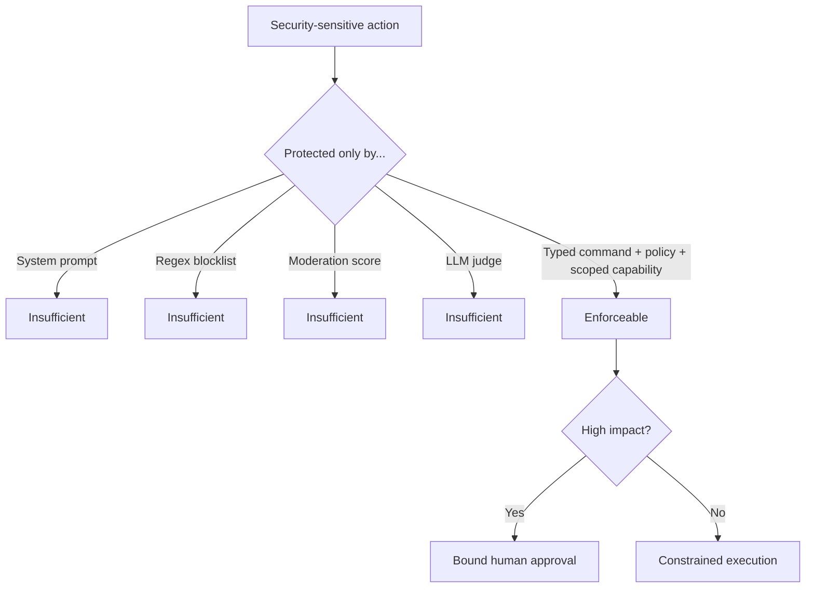

# Tool selection

Primary tools were selected for Python/Jupyter support, active maintenance, local capability, and a clear path into CI or production evidence.

| Need | Primary recommendation | Why | Production caveat |
|---|---|---|---|
| Threat modeling | **OWASP pytm 1.4.0** | Architecture as code; DFD/sequence material and relevant threats, including LLM threats | Generated threats prompt review; they are not an oracle |
| Automated probing | **NVIDIA garak 0.16.0** | Broad probe/detector ecosystem; wraps a local Python function | Pin target, probe set, run config and reports |
| Typed output | **Pydantic 2 + Guardrails AI 0.11.0** | Makes malformed and invariant-breaking output testable | Validation is not authorization |
| PII | **Presidio 2.2.364** | Custom recognizers and anonymization operators | Measure precision/recall by language and channel |
| Evaluation | **Inspect AI 0.3.259 + pytest** | Dataset/solver/scorer/log abstractions plus deterministic contracts | Separate hard invariants from model-judge scores |
| Artifact scanning | **ModelScan 0.8.8** | Static inspection of common ML artifacts before loading | Also verify provenance, hashes, signatures and isolation |
| Observability | **OpenTelemetry**, optional **Phoenix/OpenInference** | Vendor-neutral traces and AI-oriented investigation workflows | Do not emit raw prompts, secrets or full documents by default |
| Fairness | **Fairlearn 0.14.0** | Disaggregated metrics and mitigation options | Fairness is sociotechnical; metrics need harm analysis |
| Disclosure | **Hugging Face ModelCard** plus included system-card template | Versionable limitations, intended use and evidence | A card must be backed by test artifacts |

## Advanced alternatives

- **Microsoft PyRIT** for orchestrated multi-turn campaigns; its 1.x API churn makes it better as a follow-on than the first live lab.
- **Giskard** for LLM/ML scan and test workflows when already used by the team.
- **DeepEval or Ragas** for quality-oriented LLM/RAG metrics; retain deterministic security contracts.
- **NeMo Guardrails** for conversational policies; never as the only authorization boundary.
- **Adversarial Robustness Toolbox** when the audience owns the model-training/inference layer.

